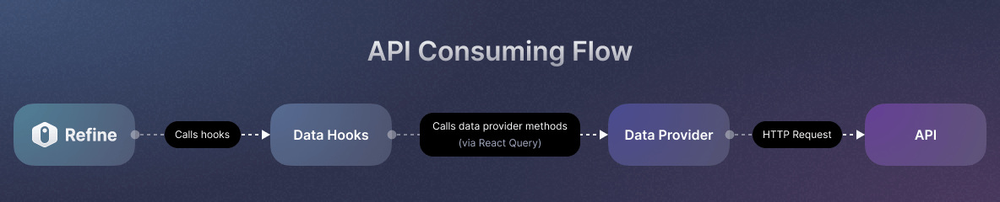

React Admin Dashboard with reat time data, charts, events, kanban, crm and more

Tech stake -> react(vite), ts, graphql, ant design, refine, nestjs

1. npm create refine-app@latest
   
   

2. we can use graphql code gen for automatically generating types for
   typescript

   https://the-guild.dev/graphql/codegen/docs/getting-started/installation

   use below commands to install and its dependencies

   npm i -D typescript @graphql-codegen/cli 

   npm install --save-dev @graphql-codegen/typescript @graphql-codegen/typescript-operations @graphql-codegen/import-types-preset prettier vite-tsconfig-paths
